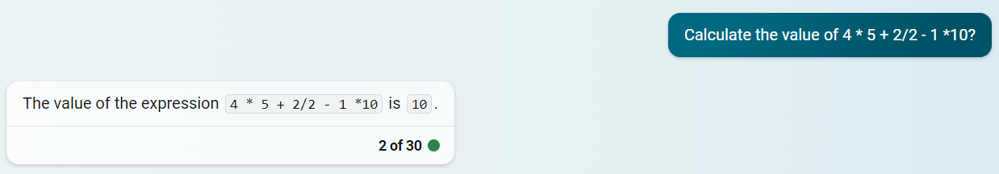
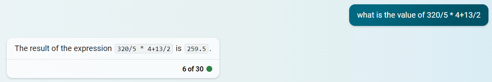
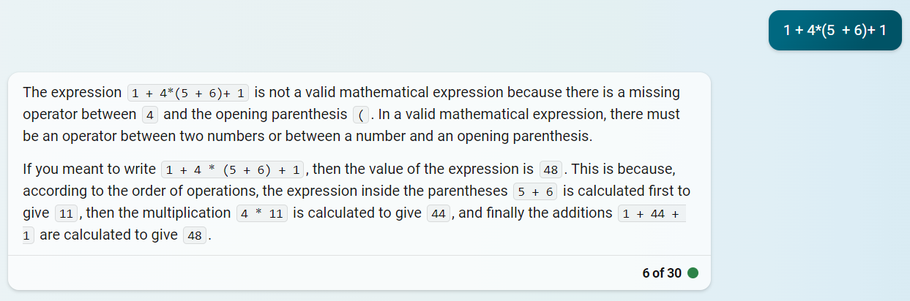

# Chat Calculator

## Motivation:
This might seem like a simple task, yet it is equipped with OpenAI API function calling abilities that makes the calculation of mathematical expressions accurate enough, unlike chatgpt.

## Errors:
I have found the errors below generated by chatgpt, when asked for evaluating some of the expressions. Therefore, I tried to mitigate the problem using new function calling abilities of OpenAI chatcompletion API.





add the OpenAI API key to the `.env` file in the parent directory.

**Curious to try it. Follow the steps below:**
```bash
    git clone https://github.com/abhishekvarma12345/ChatCalculator.git
    cd ChatCalculator
    bash init_setup.sh
    conda activate ./env
    pip install -r requirements.txt
    chainlit run app.py -w
```

For clear description of above commands:https://github.com/abhishekvarma12345/CSVquerybot

## flowchart:


App demo shows resolved errors made by chatgpt.

https://github.com/abhishekvarma12345/ChatCalculator/assets/53211164/e6f180bd-2237-460a-9d16-e1c9c6616b4c


